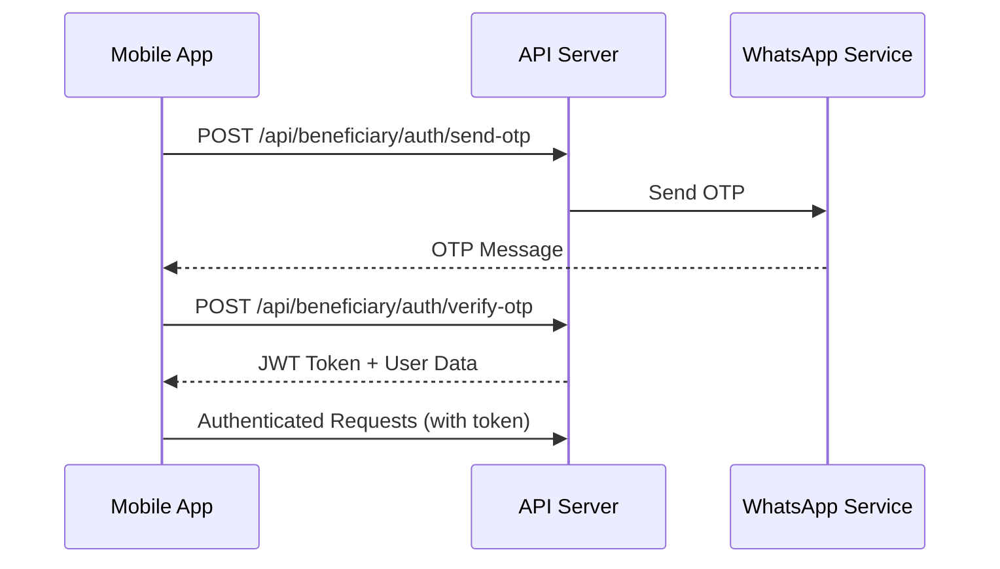

# Baithuzzakath Kerala - Beneficiary Mobile API Documentation

## 📱 Overview

This API enables beneficiaries to:
- Login with OTP authentication
- View and apply for schemes
- Track application status
- Manage their profile
- View application history and statistics

**Base URL (Development):** `http://localhost:4000`  
**Base URL (Production):** `https://api.baithuzzakath.org`

**Swagger Documentation:** `http://localhost:4000/api-docs`

---

## 🔐 Authentication

All API endpoints (except authentication endpoints) require a JWT token in the Authorization header:

```
Authorization: Bearer <your-jwt-token>
```

### Authentication Flow



---

## 📋 API Endpoints

### 1. Authentication

#### 1.1 Send OTP
```http
POST /api/beneficiary/auth/send-otp
Content-Type: application/json

{
  "phone": "9876543210"
}
```

**Response:**
```json
{
  "success": true,
  "message": "OTP sent successfully",
  "data": {
    "phone": "9876543210",
    "expiresIn": 10,
    "messageId": "msg_12345",
    "deliveryMethod": "whatsapp"
  }
}
```

**Notes:**
- Phone must be a valid 10-digit Indian mobile number (starting with 6-9)
- If user doesn't exist, a new beneficiary account is created
- OTP is valid for 10 minutes
- In development mode, OTP is returned in the response

---

#### 1.2 Verify OTP
```http
POST /api/beneficiary/auth/verify-otp
Content-Type: application/json

{
  "phone": "9876543210",
  "otp": "123456"
}
```

**Response:**
```json
{
  "success": true,
  "message": "Login successful",
  "data": {
    "user": {
      "id": "507f1f77bcf86cd799439011",
      "name": "Mohammed Ali",
      "phone": "9876543210",
      "role": "beneficiary",
      "isVerified": true,
      "profile": {
        "dateOfBirth": "1990-01-15",
        "gender": "male",
        "location": {
          "district": "507f1f77bcf86cd799439012",
          "area": "507f1f77bcf86cd799439013",
          "unit": "507f1f77bcf86cd799439014"
        }
      }
    },
    "token": "eyJhbGciOiJIUzI1NiIsInR5cCI6IkpXVCJ9..."
  }
}
```

**Store this token securely** in:
- iOS: Keychain
- Android: Keystore/EncryptedSharedPreferences

---

#### 1.3 Resend OTP
```http
POST /api/beneficiary/auth/resend-otp
Content-Type: application/json

{
  "phone": "9876543210"
}
```

**Rate Limit:** 1 request per 60 seconds

---

#### 1.4 Get Locations
```http
GET /api/beneficiary/auth/locations?type=district
GET /api/beneficiary/auth/locations?type=area&parent=507f1f77bcf86cd799439012
```

**Response:**
```json
{
  "success": true,
  "data": {
    "locations": [
      {
        "_id": "507f1f77bcf86cd799439012",
        "name": "Malappuram",
        "code": "MLP",
        "type": "district",
        "parent": "507f1f77bcf86cd799439011"
      }
    ]
  }
}
```

**Use this for cascading dropdowns:**
1. Get districts (type=district)
2. Get areas for selected district (type=area&parent={districtId})
3. Get units for selected area (type=unit&parent={areaId})

---

### 2. Profile Management

#### 2.1 Get Profile
```http
GET /api/beneficiary/auth/profile
Authorization: Bearer <token>
```

**Response:**
```json
{
  "success": true,
  "message": "Profile retrieved successfully",
  "data": {
    "user": {
      "id": "507f1f77bcf86cd799439011",
      "name": "Mohammed Ali Khan",
      "phone": "9876543210",
      "role": "beneficiary",
      "isVerified": true,
      "profile": {
        "dateOfBirth": "1990-01-15",
        "gender": "male",
        "fatherName": "Ali Khan",
        "motherName": "Fatima Khan",
        "aadhaarNumber": "1234 5678 9012",
        "rationCardNumber": "RC123456",
        "address": {
          "houseName": "Green Villa",
          "street": "MG Road",
          "landmark": "Near City Hospital",
          "pincode": "673001"
        },
        "location": {
          "district": {
            "_id": "507f1f77bcf86cd799439012",
            "name": "Malappuram",
            "code": "MLP"
          },
          "area": {
            "_id": "507f1f77bcf86cd799439013",
            "name": "Tirur",
            "code": "TRR"
          },
          "unit": {
            "_id": "507f1f77bcf86cd799439014",
            "name": "Vengara",
            "code": "VNG"
          }
        },
        "familyDetails": {
          "totalMembers": 5,
          "annualIncome": 80000,
          "occupation": "Farmer"
        }
      }
    }
  }
}
```

---

#### 2.2 Update Profile
```http
PUT /api/beneficiary/auth/profile
Authorization: Bearer <token>
Content-Type: application/json

{
  "name": "Mohammed Ali Khan",
  "profile": {
    "dateOfBirth": "1990-01-15",
    "gender": "male",
    "fatherName": "Ali Khan",
    "motherName": "Fatima Khan",
    "aadhaarNumber": "1234 5678 9012",
    "address": {
      "houseName": "Green Villa",
      "street": "MG Road",
      "pincode": "673001"
    },
    "location": {
      "district": "507f1f77bcf86cd799439012",
      "area": "507f1f77bcf86cd799439013",
      "unit": "507f1f77bcf86cd799439014"
    },
    "familyDetails": {
      "totalMembers": 5,
      "annualIncome": 80000,
      "occupation": "Farmer"
    }
  }
}
```

**Response:**
```json
{
  "success": true,
  "message": "Profile updated successfully",
  "data": {
    "user": { /* updated user object */ }
  }
}
```

---

### 3. Schemes

#### 3.1 List Available Schemes
```http
GET /api/beneficiary/schemes
GET /api/beneficiary/schemes?category=Education
GET /api/beneficiary/schemes?search=student
Authorization: Bearer <token>
```

**Response:**
```json
{
  "success": true,
  "message": "Schemes retrieved successfully",
  "data": {
    "schemes": [
      {
        "_id": "507f1f77bcf86cd799439020",
        "name": "Educational Assistance",
        "description": "Financial support for students pursuing higher education",
        "category": "Education",
        "priority": 1,
        "benefits": {
          "type": "financial",
          "amount": 50000,
          "frequency": "one-time",
          "description": "Up to ₹50,000 for educational expenses"
        },
        "eligibility": {
          "incomeLimit": 100000,
          "ageRange": {
            "min": 18,
            "max": 35
          },
          "gender": "any"
        },
        "canApply": true,
        "hasApplied": false,
        "daysRemaining": 45,
        "beneficiariesCount": 150,
        "eligibilityCriteria": [
          "Annual family income below ₹1,00,000",
          "Age between 18-35 years"
        ]
      }
    ]
  }
}
```

**Key Fields:**
- `canApply`: Whether the scheme is currently accepting applications
- `hasApplied`: Whether the user has already applied
- `daysRemaining`: Days left before application deadline
- `beneficiariesCount`: Number of approved beneficiaries

---

#### 3.2 Get Scheme Details
```http
GET /api/beneficiary/schemes/507f1f77bcf86cd799439020
Authorization: Bearer <token>
```

**Response:**
```json
{
  "success": true,
  "message": "Scheme details retrieved successfully",
  "data": {
    "scheme": {
      "_id": "507f1f77bcf86cd799439020",
      "name": "Educational Assistance",
      "description": "Financial support for students",
      "category": "Education",
      "benefits": { /* ... */ },
      "eligibility": { /* ... */ },
      "formConfiguration": {
        "title": "Educational Assistance Application",
        "description": "Please fill all required fields accurately",
        "pages": [
          {
            "title": "Personal Information",
            "fields": [
              {
                "id": "field_1",
                "label": "Full Name",
                "type": "text",
                "required": true,
                "validation": {
                  "minLength": 2,
                  "maxLength": 100
                }
              },
              {
                "id": "field_2",
                "label": "Date of Birth",
                "type": "date",
                "required": true
              },
              {
                "id": "field_3",
                "label": "Gender",
                "type": "select",
                "required": true,
                "options": [
                  { "value": "male", "label": "Male" },
                  { "value": "female", "label": "Female" },
                  { "value": "other", "label": "Other" }
                ]
              },
              {
                "id": "field_12",
                "label": "Requested Amount",
                "type": "number",
                "required": true,
                "validation": {
                  "min": 1000,
                  "max": 50000
                }
              }
            ]
          }
        ],
        "confirmationMessage": "Thank you for your application"
      },
      "canApply": true,
      "hasApplied": false,
      "daysRemaining": 45
    }
  }
}
```

**Use `formConfiguration` to dynamically render the application form in your mobile app.**

---

### 4. Applications

#### 4.1 Submit Application
```http
POST /api/beneficiary/applications
Authorization: Bearer <token>
Content-Type: application/json

{
  "schemeId": "507f1f77bcf86cd799439020",
  "formData": {
    "field_1": "Mohammed Ali Khan",
    "field_2": "1990-01-15",
    "field_3": "male",
    "field_4": "9876543210",
    "field_5": "1234 5678 9012",
    "field_12": 50000
  },
  "documents": [
    {
      "type": "aadhaar",
      "url": "https://storage.baithuzzakath.org/docs/aadhaar_123.pdf",
      "fileName": "aadhaar_card.pdf"
    }
  ]
}
```

**Response:**
```json
{
  "success": true,
  "message": "Application submitted successfully",
  "data": {
    "application": {
      "_id": "507f1f77bcf86cd799439025",
      "applicationId": "APP20250000001",
      "applicationNumber": "APP20250000001",
      "scheme": {
        "_id": "507f1f77bcf86cd799439020",
        "name": "Educational Assistance",
        "category": "Education"
      },
      "status": "pending",
      "requestedAmount": 50000,
      "submittedAt": "2025-11-17T10:30:00.000Z"
    }
  }
}
```

**Important:**
- Upload documents first using the file upload API
- Include document URLs in the `documents` array
- `formData` keys must match field IDs from form configuration
- Save the `applicationId` for tracking

---

#### 4.2 Get My Applications
```http
GET /api/beneficiary/applications
GET /api/beneficiary/applications?status=pending&page=1&limit=10
Authorization: Bearer <token>
```

**Query Parameters:**
- `status`: Filter by status (all, pending, under_review, approved, rejected, completed, cancelled)
- `page`: Page number (default: 1)
- `limit`: Items per page (default: 10, max: 50)

**Response:**
```json
{
  "success": true,
  "message": "Applications retrieved successfully",
  "data": {
    "applications": [
      {
        "_id": "507f1f77bcf86cd799439025",
        "applicationId": "APP20250000001",
        "scheme": {
          "_id": "507f1f77bcf86cd799439020",
          "name": "Educational Assistance",
          "category": "Education",
          "maxAmount": 50000
        },
        "status": "pending",
        "submittedAt": "2025-11-17T10:30:00.000Z",
        "requestedAmount": 50000
      }
    ],
    "pagination": {
      "current": 1,
      "pages": 5,
      "total": 47,
      "limit": 10
    }
  }
}
```

---

#### 4.3 Get Application Details
```http
GET /api/beneficiary/applications/507f1f77bcf86cd799439025
Authorization: Bearer <token>
```

**Response:**
```json
{
  "success": true,
  "message": "Application details retrieved successfully",
  "data": {
    "application": {
      "_id": "507f1f77bcf86cd799439025",
      "applicationNumber": "APP20250000001",
      "scheme": {
        "_id": "507f1f77bcf86cd799439020",
        "name": "Educational Assistance",
        "category": "Education",
        "benefits": { /* ... */ }
      },
      "status": "under_review",
      "requestedAmount": 50000,
      "approvedAmount": null,
      "submittedAt": "2025-11-17T10:30:00.000Z",
      "reviewedAt": null,
      "approvedAt": null,
      "formData": {
        "field_1": "Mohammed Ali Khan",
        "field_2": "1990-01-15",
        "field_3": "male"
      },
      "documents": [
        {
          "type": "aadhaar",
          "url": "https://storage.baithuzzakath.org/docs/aadhaar_123.pdf",
          "fileName": "aadhaar_card.pdf"
        }
      ],
      "reviewedBy": null,
      "approvedBy": null
    }
  }
}
```

---

#### 4.4 Cancel Application
```http
PUT /api/beneficiary/applications/507f1f77bcf86cd799439025/cancel
Authorization: Bearer <token>
Content-Type: application/json

{
  "reason": "Found another suitable scheme"
}
```

**Note:** Only applications in 'pending' or 'under_review' status can be cancelled.

---

#### 4.5 Get Application Statistics
```http
GET /api/beneficiary/stats
Authorization: Bearer <token>
```

**Response:**
```json
{
  "success": true,
  "message": "Statistics retrieved successfully",
  "data": {
    "stats": {
      "total": 15,
      "pending": 3,
      "under_review": 2,
      "approved": 8,
      "rejected": 1,
      "completed": 1,
      "totalApprovedAmount": 450000
    }
  }
}
```

---

### 5. Application Tracking

#### 5.1 Track Application
```http
GET /api/beneficiary/track/APP20250000001
Authorization: Bearer <token>
```

**Response:**
```json
{
  "success": true,
  "message": "Application tracking retrieved successfully",
  "data": {
    "application": {
      "_id": "507f1f77bcf86cd799439025",
      "applicationId": "APP20250000001",
      "scheme": {
        "_id": "507f1f77bcf86cd799439020",
        "name": "Educational Assistance",
        "category": "Education"
      },
      "status": "approved",
      "submittedAt": "2025-11-01T10:30:00.000Z",
      "reviewedAt": "2025-11-05T14:20:00.000Z",
      "approvedAt": "2025-11-10T09:15:00.000Z",
      "requestedAmount": 50000,
      "approvedAmount": 45000
    }
  }
}
```

**Status Flow:**
```
pending → under_review → approved → completed
                       ↘ rejected
                       ↘ cancelled
```

---

## 📊 Status Definitions

| Status | Description |
|--------|-------------|
| `pending` | Application submitted, waiting for review |
| `under_review` | Application is being reviewed by admin |
| `approved` | Application approved, awaiting disbursement |
| `rejected` | Application rejected |
| `completed` | Benefit disbursed successfully |
| `cancelled` | Cancelled by beneficiary |

---

## 🎨 Mobile App Implementation Guide

### React Native Example

```javascript
import AsyncStorage from '@react-native-async-storage/async-storage';

const API_BASE_URL = 'http://localhost:4000';

// 1. Login Flow
const sendOTP = async (phone) => {
  const response = await fetch(`${API_BASE_URL}/api/beneficiary/auth/send-otp`, {
    method: 'POST',
    headers: { 'Content-Type': 'application/json' },
    body: JSON.stringify({ phone })
  });
  return response.json();
};

const verifyOTP = async (phone, otp) => {
  const response = await fetch(`${API_BASE_URL}/api/beneficiary/auth/verify-otp`, {
    method: 'POST',
    headers: { 'Content-Type': 'application/json' },
    body: JSON.stringify({ phone, otp })
  });
  const data = await response.json();
  
  if (data.success) {
    // Store token securely
    await AsyncStorage.setItem('token', data.data.token);
    await AsyncStorage.setItem('user', JSON.stringify(data.data.user));
  }
  
  return data;
};

// 2. Authenticated API Calls
const getSchemes = async () => {
  const token = await AsyncStorage.getItem('token');
  
  const response = await fetch(`${API_BASE_URL}/api/beneficiary/schemes`, {
    headers: {
      'Authorization': `Bearer ${token}`,
      'Content-Type': 'application/json'
    }
  });
  
  return response.json();
};

// 3. Submit Application
const submitApplication = async (schemeId, formData) => {
  const token = await AsyncStorage.getItem('token');
  
  const response = await fetch(`${API_BASE_URL}/api/beneficiary/applications`, {
    method: 'POST',
    headers: {
      'Authorization': `Bearer ${token}`,
      'Content-Type': 'application/json'
    },
    body: JSON.stringify({ schemeId, formData })
  });
  
  return response.json();
};
```

---

## 🔒 Security Best Practices

1. **Token Storage:**
   - iOS: Use Keychain Services
   - Android: Use EncryptedSharedPreferences or Keystore

2. **HTTPS Only:** Always use HTTPS in production

3. **Token Refresh:** Implement token refresh logic before expiration (7 days)

4. **Secure Communication:** Implement certificate pinning in production

5. **Input Validation:** Validate all user inputs before sending to API

---

## 🐛 Error Handling

All API responses follow this format:

**Success:**
```json
{
  "success": true,
  "message": "Success message",
  "data": { /* response data */ }
}
```

**Error:**
```json
{
  "success": false,
  "message": "Error message",
  "error": "Detailed error information"
}
```

**Common HTTP Status Codes:**
- `200` - Success
- `400` - Bad Request (validation errors)
- `401` - Unauthorized (invalid/missing token)
- `403` - Forbidden (access denied)
- `404` - Not Found
- `429` - Too Many Requests (rate limit)
- `500` - Server Error

---

## 📱 Testing

**Swagger UI:** http://localhost:4000/api-docs

**Test Credentials:**
- Development mode uses static OTP: `123456`
- Any valid 10-digit phone number starting with 6-9

**Postman Collection:** Import the Swagger JSON from `/api-docs` into Postman

---

## 📞 Support

For API issues or questions, contact:
- Email: support@baithuzzakath.org
- Developer Portal: https://dev.baithuzzakath.org

---

## 📝 Changelog

### Version 1.0.0 (2025-11-17)
- Initial release
- OTP-based authentication
- Scheme browsing and application
- Application tracking
- Profile management
